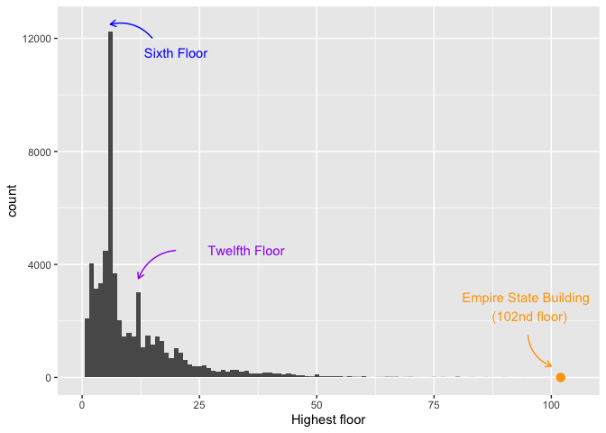

<!-- README.md is generated from README.Rmd. Please edit that file -->

# ElevatorsNYC

<!-- badges: start -->


<!-- badges: end -->

The goal of ElevatorsNYC is to provide information about all registered
elevator devices in New York City. As of November 2015, there are 76,088
elevators registered in New York City. For more information about a
specific individual elevator device, go to the [NYC Department of
Buildings Building Information
Search](http://a810-bisweb.nyc.gov/bisweb/bispi00.jsp) and enter a
device number in the Elevator Device Search.

## Installation

You can install the released version of ElevatorsNYC from
[CRAN](https://CRAN.R-project.org) with:

``` r
install.packages("ElevatorsNYC")
```

And the development version from [GitHub](https://github.com/) with:

``` r
# install.packages("devtools")
devtools::install_github("c1araaa/ElevatorsNYC")
```

## About the data

The original data was released to the public in November 2015 by the New
York State Department of Buildings after FOIL request was submitted in
September 2015. The data was made available by WNYC Data News Team.

``` r
data(ElevatorsNYC)
```

## Example

``` r
tally(ElevatorsNYC$device_type)
```

<table class="table" style="margin-left: auto; margin-right: auto;">

<thead>

<tr>

<th style="text-align:left;">

Device Type

</th>

<th style="text-align:right;">

Count

</th>

</tr>

</thead>

<tbody>

<tr>

<td style="text-align:left;">

Passenger Elevator (P)

</td>

<td style="text-align:right;">

66602

</td>

</tr>

<tr>

<td style="text-align:left;">

Freight (F)

</td>

<td style="text-align:right;">

4140

</td>

</tr>

<tr>

<td style="text-align:left;">

Escalator (E)

</td>

<td style="text-align:right;">

2663

</td>

</tr>

<tr>

<td style="text-align:left;">

Dumbwaiter (D)

</td>

<td style="text-align:right;">

1143

</td>

</tr>

<tr>

<td style="text-align:left;">

Sidewalk (S)

</td>

<td style="text-align:right;">

943

</td>

</tr>

<tr>

<td style="text-align:left;">

Private Elevator (T)

</td>

<td style="text-align:right;">

252

</td>

</tr>

<tr>

<td style="text-align:left;">

Handicap Lift (H)

</td>

<td style="text-align:right;">

227

</td>

</tr>

<tr>

<td style="text-align:left;">

Manlift (M)

</td>

<td style="text-align:right;">

73

</td>

</tr>

<tr>

<td style="text-align:left;">

Public Elevator (L)

</td>

<td style="text-align:right;">

45

</td>

</tr>

</tbody>

</table>

As of 2015, there was about a total of 76,000 elevator devices in New
York City.

``` r
tally(ElevatorsNYC$borough)
```

<table class="table" style="margin-left: auto; margin-right: auto;">

<thead>

<tr>

<th style="text-align:left;">

Borough

</th>

<th style="text-align:right;">

Count

</th>

</tr>

</thead>

<tbody>

<tr>

<td style="text-align:left;">

Manhattan

</td>

<td style="text-align:right;">

43596

</td>

</tr>

<tr>

<td style="text-align:left;">

Brooklyn

</td>

<td style="text-align:right;">

13980

</td>

</tr>

<tr>

<td style="text-align:left;">

Queens

</td>

<td style="text-align:right;">

9683

</td>

</tr>

<tr>

<td style="text-align:left;">

Bronx

</td>

<td style="text-align:right;">

7575

</td>

</tr>

<tr>

<td style="text-align:left;">

Staten Island

</td>

<td style="text-align:right;">

1227

</td>

</tr>

<tr>

<td style="text-align:left;">

NA

</td>

<td style="text-align:right;">

27

</td>

</tr>

</tbody>

</table>

As of 2015, out of the five boroughs in NYC, Manhattan has the greatest
number of elevator devices.



Looking at distribution of NYC elevators and the floors at which they
max out at. It is interesting to see a clear mode at 6 floors. A [New
York Times
article](https://www.nytimes.com/2007/06/03/nyregion/thecity/03wate.html)
explains that buildings over six stories use a pump to fill tanks.
Another [NYT
article](https://www.nytimes.com/2008/05/11/realestate/11cov.html)
reports that since 1968, NYC has required builders to install elevators
in all new residential buildings that have five or more stories. So, it
is not surprising that an overwhelming number are elevators are built
for buildings that are six stories high - hitting the perfect sweet spot
of not having a water pump while having a building tall enough to
install an elevator.
